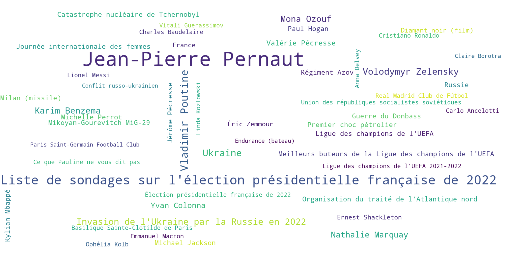

# Wikipedia Meter

Wikipedia meter is a project whose goal is to display the most viewed topics on wikipedia for a given day. A bot tweets the picture of the previous day every day, and a website allows you to explore all the dates.

Twitter bot: https://twitter.com/wikimeter

Website: http://wiki.movizz.fr/

**Example of a day** (09/03/2022):

## Additional information
- The bot tweets every day at 7am
- On the picture, we select only the 50 most read articles of the day in France, the size of the words corresponds to the number of views
- The color is chosen randomly (work in progress to categorize the subjects)
- Statistics are retrieved from the [Wikipedia API](https://wikitech.wikimedia.org/wiki/Analytics/AQS/Pageviews)
